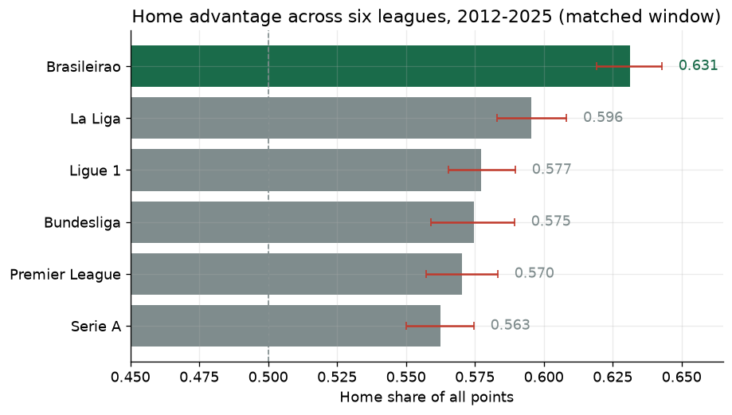
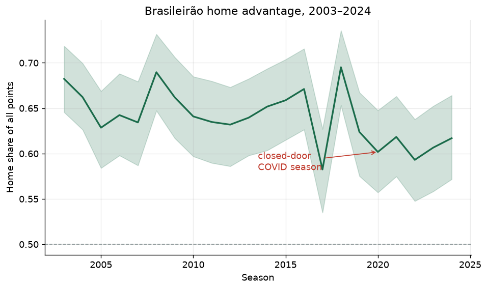
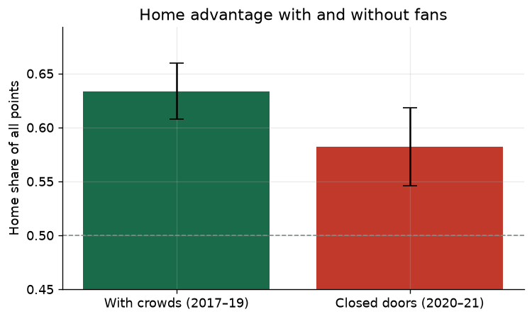
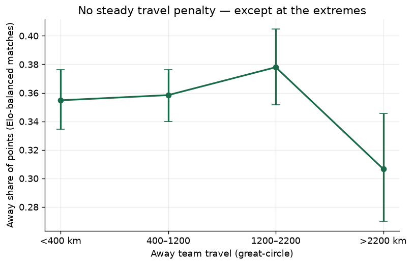
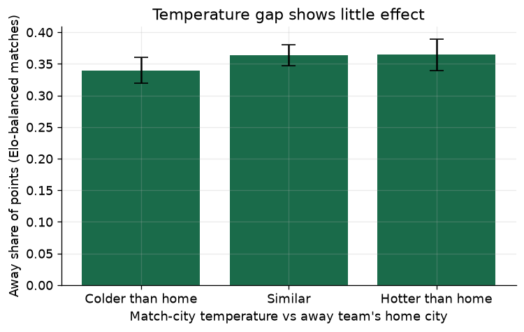
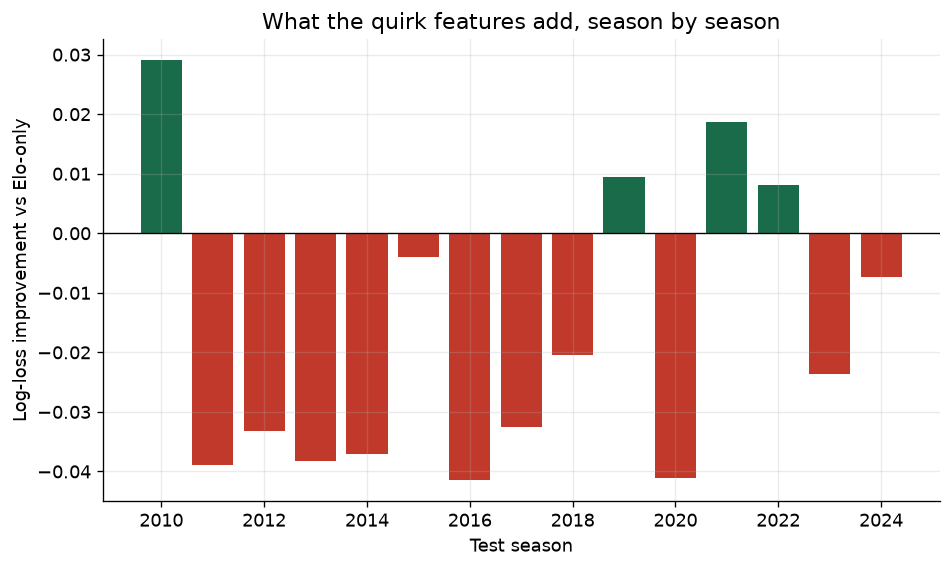
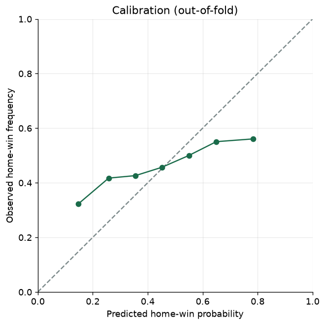
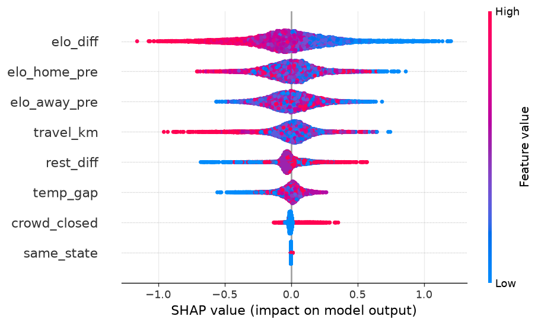
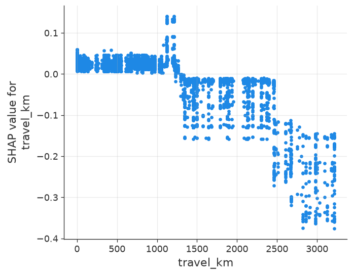

# Anatomy of the World's Strongest Home Advantage

On a Sunday afternoon, Grêmio's squad boards a flight in Porto Alegre, Brazil's
southernmost state capital, bound for Belém — a port city at the mouth of the
Amazon, roughly 3,200 km away, about the distance from London to Moscow —
where Paysandu will be waiting at home. That trip happens inside a single
country, in a single league, as a completely ordinary fixture. Twenty-two
seasons of the Campeonato Brasileiro Série A ("Brasileirão"), Brazil's top
flight, are full of trips like it, and every one tilts the odds toward
whoever gets to sleep in their own bed that week.

This project asks a simple question with a less simple answer: how big is
Brazilian football's home advantage, really, and what actually causes it?
Using twenty-two years of match results (2003–2024), a natural experiment
created by the COVID-19 pandemic, curated stadium geography, and a
gradient-boosted outcome model with feature-by-feature explanations (SHAP,
introduced in the modelling section below), this analysis measures the
advantage, tests three candidate causes — crowd support, travel distance,
and climate — and reports plainly which ones hold up and which don't.

The hook that made this worth investigating in the first place: measured
against two of the best-supported leagues on the planet, using the identical
metric over the identical 2015–2018 window, Brazilian home teams collected
**0.652** of every league point up for grabs — a "points share," the fraction
of all points actually awarded in a set of matches that went to the home
side, explained fully below — compared with **0.600** in Spain's La Liga and
**0.585** in England's Premier League.



**Methods at a glance:** this project demonstrates causal (pre-match-only)
Elo ratings, bootstrap confidence intervals, a natural-experiment /
quasi-experimental design (the COVID closed-door window), Elo-balanced
subgroup comparisons, expanding-window time-series cross-validation with
early stopping, probability calibration, and SHAP-based model
interpretation.

## How big is it?

Across the full 2003–2024 history — 8,785 matches — Brazilian home teams
have taken **0.6407** of all points awarded (3 for a win, 1 each for a
draw). This "home points share" is the metric the whole project is built on:
sum every point actually handed out across a set of matches, and ask what
fraction went to the team playing at home. A value of 0.5 would mean home
and away teams earned points at identical rates — no home advantage at all;
above 0.5 favours home teams, below would favour visitors. Because a draw
splits only two points between two teams instead of handing three to a
winner, this share sits well above the raw "home win rate" most fans have in
their head (49.6% of matches are home wins, 26.4% draws, 23.9% away wins) —
the accounting itself pulls the number upward before home advantage even
enters the picture.



The chart above plots that share season by season, with a shaded band
showing a 95% bootstrap confidence interval — built by resampling each
season's matches with replacement 2,000 times and reading off the middle 95%
of the resulting values, a way of expressing how much a single season's
number could plausibly have differed by chance alone. It's tempting to read
the 2020 dip as proof that empty COVID stadiums killed home advantage, and
the chart is annotated to invite exactly that reading — but look one line to
either side: 2017 (0.582) and 2022 (0.593), both played in front of full
crowds, sit lower still, and 2020 (0.602) is only the third-lowest season in
the entire twenty-two-year run. Season-level swings are large enough that no
single season proves anything about crowds, fatigue, or anything else on its
own. That is exactly why the crowd question below is answered with a
match-level window comparison, not a single point read off this chart.

## What an empty stadium revealed

Between August 2020 and September 2021, the Brasileirão was played behind
closed doors — a pandemic containment measure that removed fans from
stadiums while leaving almost everything else about the matches untouched:
same teams, same stadiums, same travel, same climate, same opposition. That
combination makes the closed-door window about as close to a natural
experiment as a historical football dataset offers: if home advantage drops
when the crowd disappears, the size of that drop is a reasonable estimate of
what fans alone contribute.

Comparing the 594 closed-door matches against 1,140 matches from three
ordinary, full-crowd seasons immediately before the pandemic (2017–2019) —
rather than the entire 2003–2024 history, so the comparison isn't diluted by
earlier or later eras of the league — home points share fell from **0.634**
with crowds to **0.582** without them: a drop of **0.051**, with a 95%
bootstrap confidence interval of **[0.009, 0.095]**. Because that interval
sits entirely above zero, the direction of the effect is fairly trustworthy —
crowds add something — but the interval is wide, so this is evidence that an
effect exists, not a precise measurement of its size.



Three things temper how far to read into this number. First, it's a
before/after comparison of two non-randomised windows, not a controlled
trial. Second, the 2020–21 season restarted five months late and was then
played on a heavily compressed calendar, with many clubs juggling continental
competition alongside it — schedule congestion known to erode home advantage
on its own, independent of crowds, and pushing in the same direction as the
effect measured here. That means 0.051 is best read as an upper bound on
what crowds alone contribute, not a clean isolated estimate. Third, the
width of the confidence interval means this analysis can defend the
*existence* of a crowd effect with more confidence than its exact
*magnitude*.

## The 3,000-kilometre away day

Brazil is a continental-scale country, and Brasileirão fixtures reflect it:
the average away trip in this dataset covers 946 km, some journeys — like
Grêmio's flight to face Paysandu described above — top 3,200 km, and 5.6% of
matches are same-city derbies with no travel at all. If travel wears teams
down or disrupts their routine, the away side should perform worse the
farther it has flown.

The obvious confound: teams that travel the farthest aren't a random sample
of opponents. A club based far from the country's economic centres might
travel long distances specifically to face bigger, richer opposition, which
would tangle "distance" together with "facing a stronger team." To cut that
out, this analysis restricts to fixtures where the two teams are evenly
matched on paper before kickoff — a pre-match Elo rating difference of 75
points or less. (Elo is a rating system, originally built for chess, that
estimates a team's strength purely from the outcomes of its past matches; a
*causal* Elo, as used throughout this project, means every rating is
computed strictly from matches that happened before the one being predicted,
so no match ever leaks information into its own pre-match rating.) That
restriction narrows the sample from 8,785 to 5,626 matches, and the near-zero
mean Elo gap reported within each distance bin is the evidence the balancing
trick worked.



The result is not the smooth "farther is harder" story a simple intuition
might predict. Away points share sits at 0.355 for trips under 400 km, 0.358
for 400–1,200 km, and actually *rises* to 0.378 for 1,200–2,200 km — all
three overlapping within their confidence intervals, meaning there is no
detectable steady penalty across most of the range travel actually covers.
Only beyond 2,200 km does the picture change: away points share drops to
0.307, a fall of 0.072 versus the neighbouring 1,200–2,200 km bin, with a
95% confidence interval of [0.025, 0.116] on that specific comparison — real,
but confined entirely to the most extreme journeys rather than spread evenly
across the whole range.

## Heat as a twelfth man?

The Brasileirão spans a genuinely enormous range of climates, from temperate
Porto Alegre in the south to the tropical, often 30°C-plus heat of cities
like Fortaleza and Salvador in the Northeast. A southern club forced to play
in that heat is facing a real physiological burden layered on top of travel
— a plausible extra source of home advantage. Using the same Elo-balanced
subset and the same logic as the travel test, this analysis bins fixtures by
how much hotter or colder the match city is than the away team's home city
and compares away performance across bins.



The result is a clean null: away points share is 0.340 when the away team
travels somewhere colder than home, 0.364 when the climate is similar, and
0.365 when it's hotter — every one of those intervals overlaps the others,
so none of the differences is distinguishable from chance. Whatever gives
Brazilian home teams their edge, this measure of climate doesn't capture it.

That said, the result deserves a specific caveat rather than a flat "heat
doesn't matter." The temperature figure behind this test, `temp_gap`, is
built from each city's *annual mean* temperature, not the actual weather on
match day — it can't tell a January afternoon in Fortaleza from a mild July
evening there. A crude, static proxy like that is far better at detecting a
large effect than a subtle one, so this null result is weak evidence at
best: it rules out a large, climate-driven home advantage, but it cannot
rule out a smaller one that a genuine match-day temperature reading might
reveal.

## Can a model cash these in?

Everything above measures *aggregate* effects — how a whole season's or a
whole window's worth of points splits between home and away teams. The next
question is different: do any of these quirks — travel, temperature, rest,
crowd status, playing a team from the same state — actually help predict the
outcome of one specific match, once they compete against a measure of team
strength and against each other inside a single model?

Before that comparison can mean anything, both candidate models have to
clear a lower bar: can they beat simply predicting the historical
home/draw/away frequencies, with no features at all? That "class-prior"
baseline — predict 49.6% home win, 26.4% draw, 23.9% away win for every
match, forever — scores a mean **log loss** of **1.0514** under
expanding-window, season-by-season cross-validation (log loss is a standard
scoring rule for probabilistic forecasts: it rewards confident correct
predictions, punishes confident wrong ones heavily, and a *lower* score is
better; unlike plain accuracy, it cares how sure the model was, not just
whether it picked the right class). A model trained on causal Elo ratings
alone — LightGBM, a gradient-boosted tree model, fit with early stopping
against a held-out validation season inside each training fold so it can't
simply memorise the training data — scores **1.0303**, beating the naive
floor in all 15 test seasons. Adding the full set of quirk features (travel,
heat, rest, crowd status, same-state derbies) on top of Elo scores
**1.0318** — also 15 of 15 seasons ahead of the floor, but very slightly
*behind* the Elo-only model.



That gap between the two fitted models — a mean lift of **−0.0015**,
positive in only 8 of 15 seasons — is an order of magnitude smaller than
either model's edge over the naive floor, and statistically indistinguishable
from noise. In plain terms: Elo already captures almost everything about a
match that is predictable from historical results, and none of travel, heat,
rest, crowd status, or same-state derbies adds measurable per-match
forecasting skill once Elo is already in the model. `same_state` in
particular contributes essentially nothing.

The model's **calibration** — whether a predicted probability actually
matches the observed frequency, i.e. whether matches given a 60% chance of a
home win actually produce a home win about 60% of the time — sits close to
the diagonal through the bulk of its predictions, with only mild
overconfidence at the strongest-favourite end.



**SHAP** (SHapley Additive exPlanations — a method that attributes each
individual prediction to the contribution of each input feature) confirms
the same story from a different angle. Across the full model, `elo_diff` —
the gap in Elo ratings between the two teams — dwarfs every other feature in
importance; `travel_km` is the strongest of the quirk features, but a
distant third overall; `same_state` contributes almost nothing.



The SHAP dependence plot for travel distance reproduces the non-linear shape
found earlier with plain bootstrap confidence intervals: a staircase rather
than a smooth slope, flat through the short and medium range with a real
step down only at the long end. Running the model as a counterfactual —
holding every other feature fixed and only changing the distance travelled —
the average predicted away-win probability moves from **25.4%** at 0 km, to
**23.7%** at 2,000 km, to **19.1%** at 3,000 km: a small, gradual drop over
the first 2,000 km and a much sharper one over the last 1,000.



Finally, a market benchmark, reported for context rather than as a target
this project claims to beat: Pinnacle's closing odds (available for the
Brasileirão from 2012 onward via football-data.co.uk) imply a mean log loss
of **0.9994** on the matched subset, ahead of both the Elo-only model
(1.0278) and the full model (1.0299) on the same rows. Bookmakers price in
same-day lineup news, injury reports, and market money that this project's
historical-results-only feature set simply doesn't have access to, so this
gap isn't a failure of the model — it's a reminder of how much of a football
match is genuinely unpredictable from box-score history alone.

Put together, the honest takeaway of this whole chapter is a distinction,
not a single number: the crowd, travel, and heat effects documented above
are real (or plausibly real) at the *aggregate*, whole-season or
whole-window level, but that is a different claim from being *predictive* at
the level of one match. Elo already captures nearly everything that is
forecastable about an individual fixture, and stacking these quirks on top
of it does not sharpen that forecast. That distinction — aggregate signal
versus per-match prediction — is the finding this project is most confident
stands up to scrutiny.

## Limitations

- **`temp_gap` is a crude, static proxy.** It uses each city's annual mean
  temperature rather than the actual weather on the day of the match, so the
  heat null result above rules out a large climate effect but cannot rule
  out a smaller one that a genuine match-day reading might reveal.
- **Stadium coordinates are city-level, not stadium-level.** Clubs that
  share a city (several clubs based in Belo Horizonte, for instance) share
  identical latitude/longitude in the curated reference data, so travel
  distances are accurate between cities but not sensitive to a specific
  stadium's exact location within one.
- **Rest days only track Série A league fixtures.** The `rest_diff` feature
  can't see cup or continental fixtures, so it understates how tired a club
  actually was in any season — like 2020–21 — with a congested non-league
  schedule.
- **The crowd effect is a before/after comparison, not a randomised
  trial.** The closed-door window and its control seasons differ in more
  than crowd presence alone; schedule congestion in 2020–21 is a known
  confounder pointing in the same direction as the measured effect, so 0.051
  is best read as an upper bound rather than a clean isolated estimate.
- **The sample is a single league across 22 seasons.** 8,785 matches is
  enough to detect the effects reported here with reasonable confidence, but
  it's a modest sample for splitting into finer subgroups, and every finding
  in this project is specific to the Brazilian Série A — not a general claim
  about football everywhere.

## Reproduce

Data sources, downloaded automatically on first run and cached under
`data/raw/` (not committed to the repository):

- **Match results** — the `adaoduque/Brasileirao_Dataset` GitHub repository
  (full Brasileirão history, 2003–present).
- **European league results** — season-by-season CSVs from
  [football-data.co.uk](https://www.football-data.co.uk/) (Premier League
  `E0`, La Liga `SP1`).
- **Bookmaker odds** — Pinnacle closing odds from football-data.co.uk's
  `BRA.csv`.

The curated stadium coordinates (latitude, longitude, elevation, annual mean
temperature) used for the travel and heat analyses live in
`data/reference/stadiums.csv` and are committed to the repository.

```powershell
# 1. Create the environment (Python 3.13)
py -3.13 -m venv .venv
.venv\Scripts\python -m pip install -e ".[dev]"

# 2. Run the tests
.venv\Scripts\python -m pytest -q

# 3. Build the dataset and run the analysis notebooks
.venv\Scripts\python -c "from brasileirao import ingest; ingest.build()"
.venv\Scripts\python -m jupyter nbconvert --to notebook --execute --inplace notebooks/01_data_overview.ipynb --ExecutePreprocessor.timeout=600
.venv\Scripts\python -m jupyter nbconvert --to notebook --execute --inplace notebooks/02_home_advantage_story.ipynb --ExecutePreprocessor.timeout=600
.venv\Scripts\python -m jupyter nbconvert --to notebook --execute --inplace notebooks/03_model_and_shap.ipynb --ExecutePreprocessor.timeout=600
```

Every number and figure in this README was produced by running exactly this
sequence against a freshly deleted `data/processed/` directory.

## Roadmap

This is Chapter A of a planned three-chapter anthology; the full design
lives in
[`docs/superpowers/specs/2026-07-19-brasileirao-home-advantage-design.md`](docs/superpowers/specs/2026-07-19-brasileirao-home-advantage-design.md).

- **[Chapter B — cross-league unpredictability](docs/chapter-b-unpredictability.md).**
  How competitively balanced is the Brasileirão compared with Europe's big
  five — measured through outcome entropy, underdog points share, model and
  market calibration, Noll–Scully standings spread, and title-race /
  relegation-race volatility, not just home advantage? *(Verdict: the most
  unpredictable of the six at both the match and the season level.)*
- **[Chapter C — the mid-season exodus](docs/chapter-c-exodus.md).** Brazil's
  transfer windows don't align with Europe's; star players (Neymar, Vinicius,
  Rodrygo, Endrick…) are routinely sold to Europe mid-season. Does that misalignment
  show up as a measurable rest-of-season dip for the clubs left behind — measured on
  full Transfermarkt-scraped departures via a dose–response and a major-sale event
  study against a placebo no-effect floor? *(Verdict: no detectable effect, now
  well-powered — the dose–response is flat and the effect flips sign as the sale-size
  threshold rises.)*
