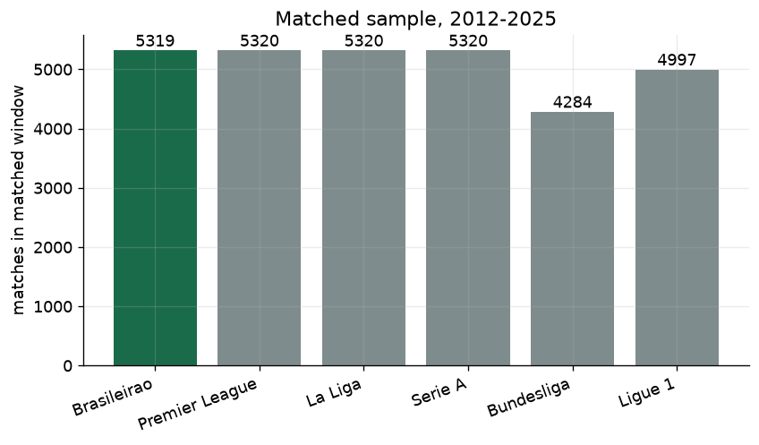
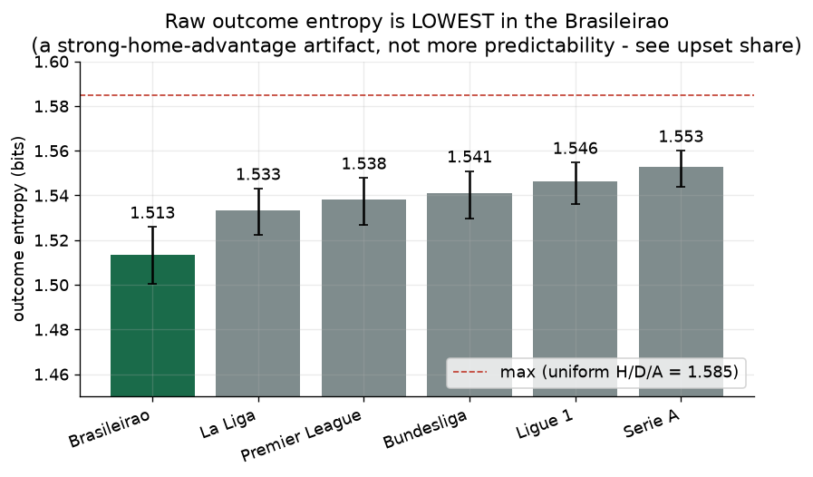
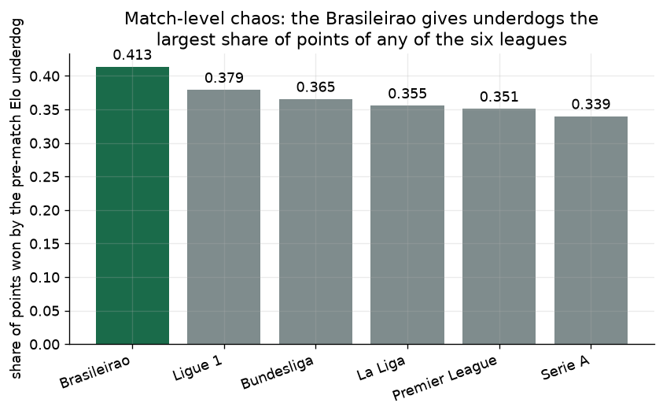
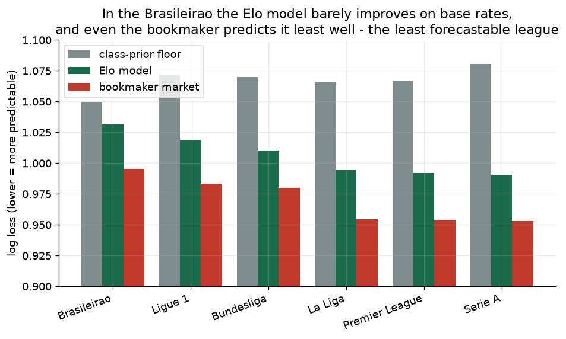
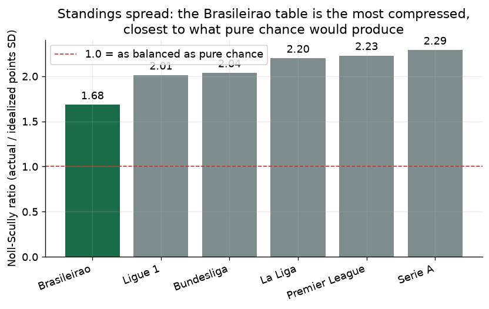
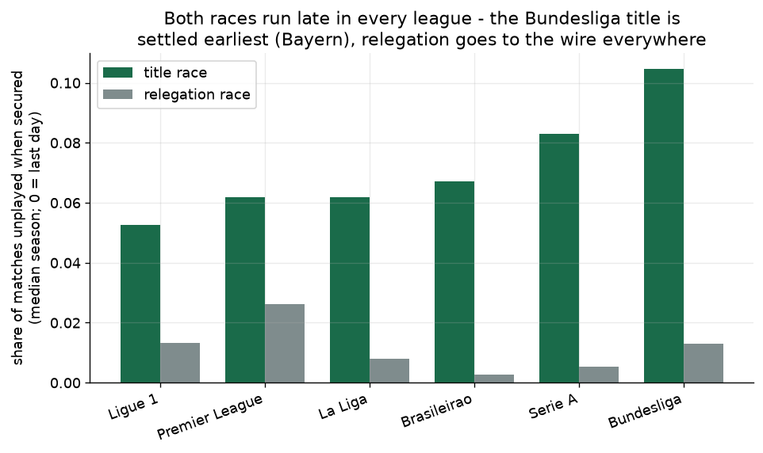
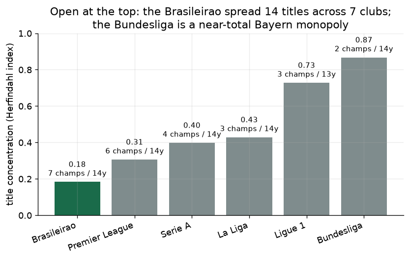
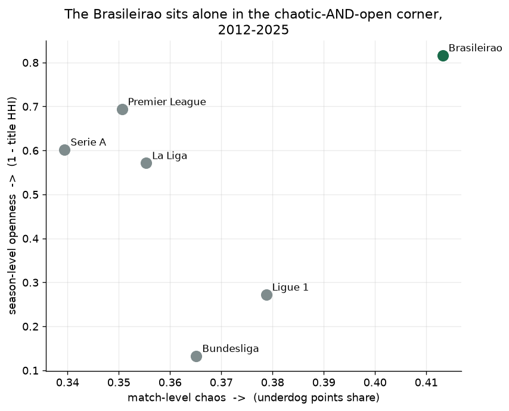

# Chapter B — Anyone Beats Anyone? Measuring the Brasileirão's Unpredictability

Ask a Brazilian supporter why their league is the best show on earth and you
will hear some version of the same sentence: *aqui, qualquer um ganha de
qualquer um* — here, anyone beats anyone. It is said with pride, usually right
after a bottom-of-the-table side has just knocked over a title contender on a
Wednesday night. It is also, conveniently, a claim you can measure.

But "unpredictable" hides two very different questions, and a league can answer
them in opposite directions. One is about a **single match**: is any given
weekend a coin flip, where the favourite's edge is small and upsets are
routine? The other is about a **whole season**: after nine months of those
matches, does the trophy still end up with the same giant every year? A league
can be chaotic week to week and still crown a serial champion — Bayern Munich's
Bundesliga is the textbook case. So this chapter tests the reputation at both
levels, against Europe's big five, over the same matched window, and reports
which of three verdicts the data actually supports:

- **(a)** genuinely chaotic *and* genuinely open,
- **(b)** chaotic weekends, but the same clubs win anyway,
- **(c)** not actually more unpredictable than Europe once measured properly.

Everything below reuses Chapter A's machinery unchanged — causal (pre-match
only) Elo ratings, an expanding-window model with a class-prior floor, bootstrap
confidence intervals — applied identically to all six leagues, with nothing
tuned per league.

## The matched sample

The six leagues are loaded from a single source (football-data.co.uk), which
carries results **and** bookmaker closing odds in the same rows, over every
season complete in all six from **2012 to 2025** — **30,560 matches**. Seasons
are labelled by the calendar year they start, so Brazil's calendar-year 2012 and
Europe's 2012/13 line up directly.



Two structural facts show up in that chart and matter later: the **Bundesliga**
fields 18 teams (306 matches a season, not 380), and **Ligue 1** cut from 20 to
18 teams in 2023, so it contributes fewer matches than the other four. Two real
gaps are handled explicitly rather than papered over — Brazil's 2016 season is
missing exactly one fixture (Chapecoense v Atlético-MG, annulled after the LaMia
air disaster), and Ligue 1's 2019/20 season was cancelled outright by COVID
after 279 of 380 matches. The first is retained everywhere; the second is kept
for match-level metrics but excluded from the season-table metrics, whose
standings shape assumes a full schedule. Bookmaker odds cover 96–99% of rows in
every league.

## How to measure "unpredictable"

Three metrics for each level.

**At the match level:**

- **Outcome entropy** — the Shannon entropy (in bits) of the home/draw/away
  split. A perfect three-way coin flip scores log₂3 ≈ **1.585**; a league where
  one result dominates scores lower. *This one comes with a health warning,
  spelled out below.*
- **Underdog points share** — of all the points won across the league, what
  fraction went to the team the pre-match Elo rating said was weaker. Pure
  chance with a home edge still hands most points to favourites, so a *higher*
  underdog share is a direct, home-advantage-proof reading of match chaos.
- **Forecastability** — the log loss of the Elo model, measured against two
  reference points: the **class-prior floor** (a model with no features that
  just predicts each league's base H/D/A rates) and the **bookmaker market**
  (the de-vigged closing odds). If the model can barely beat the floor, the
  league's matches carry little that is forecastable in the first place. *A
  model that loses to the floor is mis-specified, not a finding* — so the
  notebook refuses to compare any league until every model clears its own
  floor, a discipline carried straight over from Chapter A.

**At the season level:**

- **Noll–Scully** — the spread of final-table points divided by the spread you
  would expect if every team were equal strength (estimated by simulating each
  season's exact fixture list from its own H/D/A rates). A ratio near **1.0**
  means the table is as compressed as pure chance; higher means real,
  persistent strength gaps.
- **Race decidedness** — for each season, the share of matches still unplayed at
  the moment the title (and, separately, relegation) became *mathematically*
  secured. Zero means it went to the final day; higher means it was over early.
  Normalised by season length so 34- and 38-game leagues compare.
- **Title concentration** — the Herfindahl index of champions over the window:
  **1.0** if one club won every year, lower the more the trophy is shared.

### The entropy trap

Raw entropy is the one metric that lies here, and it is worth being explicit
about why. A strong home advantage — which Chapter A showed is *stronger in
Brazil than anywhere* (a 0.64 home points share over two decades) — pushes
results toward the home win, and a more lopsided H/D/A split has *lower*
entropy. So the league that is hardest to predict in every other sense will look
*more* predictable on raw entropy, purely because of its home edge. Entropy is
shown for completeness, but the underdog share and the model-versus-floor gap
are the honest match-level signals. Watch the confound resolve itself in the
next two figures.

## Level 1 — Is every weekend a coin flip?



Exactly as warned, the Brasileirão has the **lowest** raw entropy of the six
(**1.513** bits, against Serie A's league-high **1.553** and a theoretical
maximum of 1.585). Taken at face value that would make Brazil the *most*
predictable league — which is precisely backwards, and precisely the artifact of
its outsized home advantage concentrating results on the home win. The
confidence intervals are tight but the differences between leagues are small;
this chart's real job is to be the cautionary one.



Switch to the home-advantage-proof metric and the picture inverts. In the
Brasileirão, pre-match underdogs collect **41.3%** of all points on offer — the
**highest** of the six leagues, ahead of Ligue 1 (37.9%) and well clear of Serie
A, where underdogs manage just **33.9%**. Roughly speaking, the Brazilian
underdog banks about a fifth more of the available points than its Italian
counterpart. Weekend to weekend, the favourite's edge really is smaller in
Brazil.



Forecastability tells the same story from the model's side. Every league clears
its floor (the mis-specification gate passes for all six), but by how much varies
enormously. In the big European leagues the Elo model cuts a wide gap below the
floor — Serie A's model beats its floor by **0.090** log-loss units, the Premier
League's by 0.075. In the **Brasileirão the gap is just 0.018**: the model,
knowing each team's full rating history, is barely more informative than a table
of base rates. And the market agrees — even the bookmakers' closing odds predict
Brazil least well of any league (a market log loss of **0.995**, against
**0.953** in Serie A). When the sharps' prices are your least confident, the
matches genuinely carry the least signal. Level 1's verdict: yes, the Brazilian
weekend is closer to a coin flip than any European one.

## Level 2 — But does the same giant win anyway?

Chaotic weekends are necessary for an open league, not sufficient. A season is
120-odd matches long; noise can wash out, and the strongest squad can still
grind to the top. Does it?



No. The Brasileirão's final tables are the **most compressed** of the six, with
a Noll–Scully ratio of **1.68** — still above the chance baseline of 1.0 (some
teams really are better), but far closer to it than Serie A (**2.29**) or the
Premier League (**2.23**), where the points spread is more than twice what
equal-strength teams would produce. The chaos does *not* wash out; it survives
into the standings.



Race decidedness is the one place Brazil is *not* an outlier, and it is worth
saying so plainly. Both races run late in every league — titles are typically
secured with only 5–10% of the season left, relegation later still. The
Bundesliga title is settled earliest (Bayern clinches with a league-high **10%**
of matches to spare); the Brasileirão sits mid-pack on the title race
(**6.7%**), while having the latest-decided relegation of any league. There is no
strong cross-league differentiator here — a modest, honest result, not a
headline.



The title-concentration chart is where the season-level story lands hardest.
Over these fourteen years the Brasileirão was won by **seven different clubs**,
the most of any league, for a Herfindahl index of just **0.18** — the lowest,
i.e. the most open. The contrast with the Bundesliga (**0.87**, essentially a
Bayern monopoly with two distinct champions in fourteen years) and Ligue 1
(**0.73**, PSG) is stark, and even the comparatively open Premier League
(**0.31** — six different champions, yet seven of the fourteen titles Manchester
City's alone) is meaningfully more concentrated than Brazil.

## Synthesis — match chaos vs open competition

Put the two levels on one plane — match-level chaos across, season-level openness
up — and the whole argument collapses into a single point.



The Brasileirão sits **alone in the chaotic-and-open corner**: the highest
underdog points share *and* the most shared title of any of the six leagues.
Formally, its underdog share (0.413) exceeds the European maximum (0.379), its
title openness (0.816) exceeds the European maximum (0.694), and its
Elo-over-floor gap (0.018) is smaller than the smallest in Europe (0.053) — so on
all three lead metrics it is the extreme. The verdict is unambiguous
**outcome (a): the Brasileirão is the most unpredictable at both levels** — a
genuine coin flip on Saturday that adds up to a genuinely open title race in
December. *Qualquer um ganha de qualquer um* turns out to be not just folklore
but the correct reading of fourteen years of results.

## Limitations

- **Fourteen seasons is a short horizon for a title-concentration verdict.**
  The Herfindahl index over 14 champions is a small sample: one dynasty (a
  hypothetical five-in-a-row) would move Brazil's 0.18 substantially, whereas
  Bundesliga's 0.87 is nearly saturated and cannot move much. The *ranking* is
  robust — Brazil is clearly the most shared — but the exact gaps should be read
  as indicative, not precise.
- **The market benchmark has coverage gaps.** The bookmaker log loss is computed
  only on the 96–99% of matches that carry closing odds, and coverage differs
  slightly by league; the market comparison is a corroborating context line, not
  a like-for-like head-to-head on identical samples.
- **Raw entropy carries a home-advantage confound** — named above, and the
  reason the match-level conclusion rests on underdog share and model log loss
  rather than on entropy. Reported so the reader can see the confound rather than
  be misled by it.
- **Two seasons needed special handling.** Ligue 1's COVID-cancelled 2019/20 is
  excluded from season-table metrics (kept for match-level), and Brazil's 2016
  is one annulled fixture short; both are documented in Notebook 04 rather than
  silently dropped or included.
- **Metrics, not mechanisms.** This chapter measures *how* unpredictable each
  league is, not *why*. Whether Brazil's openness comes from a compressed talent
  distribution, its punishing travel and climate (Chapter A), mid-season squad
  churn (Chapter C), or something else is a separate question this chapter does
  not answer.

## Reproduce

Data (results and Pinnacle/Bet365 closing odds for all six leagues) is
downloaded automatically on first run from
[football-data.co.uk](https://www.football-data.co.uk/) and cached under
`data/raw/` (not committed). The matched table is written to
`data/processed/leagues.parquet` (regenerated, not committed).

```powershell
# 1. Create the environment (Python 3.13)
py -3.13 -m venv .venv
.venv\Scripts\python -m pip install -e ".[dev]"

# 2. Run the tests
.venv\Scripts\python -m pytest -q

# 3. Assemble the six-league dataset, then compute the metrics and figures
.venv\Scripts\python -m jupyter nbconvert --to notebook --execute --inplace notebooks/04_cross_league_data.ipynb --ExecutePreprocessor.timeout=1200
.venv\Scripts\python -m jupyter nbconvert --to notebook --execute --inplace notebooks/05_unpredictability_and_balance.ipynb --ExecutePreprocessor.timeout=1800
```

Notebook 04 confirms the matched window from real fixture counts and caches the
dataset; Notebook 05 computes all six metrics for all six leagues, enforces the
class-prior floor gate, and writes every figure embedded above. Each number in
this article traces to a value printed by Notebook 05.
