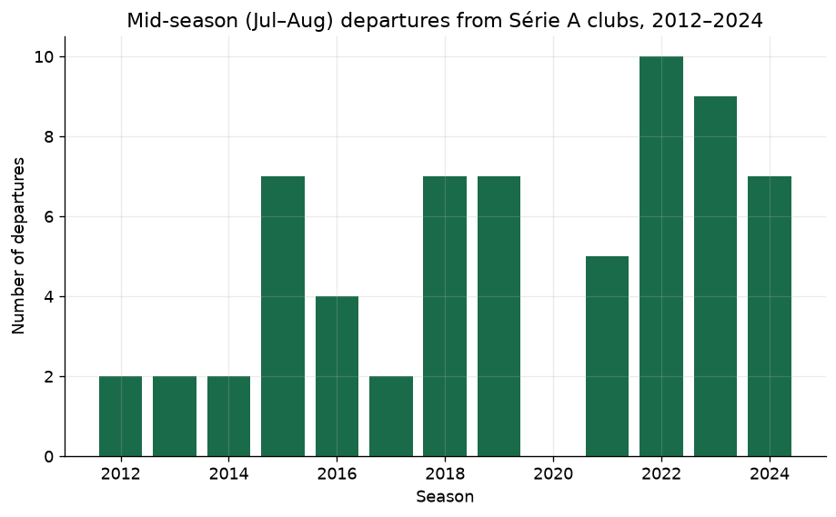
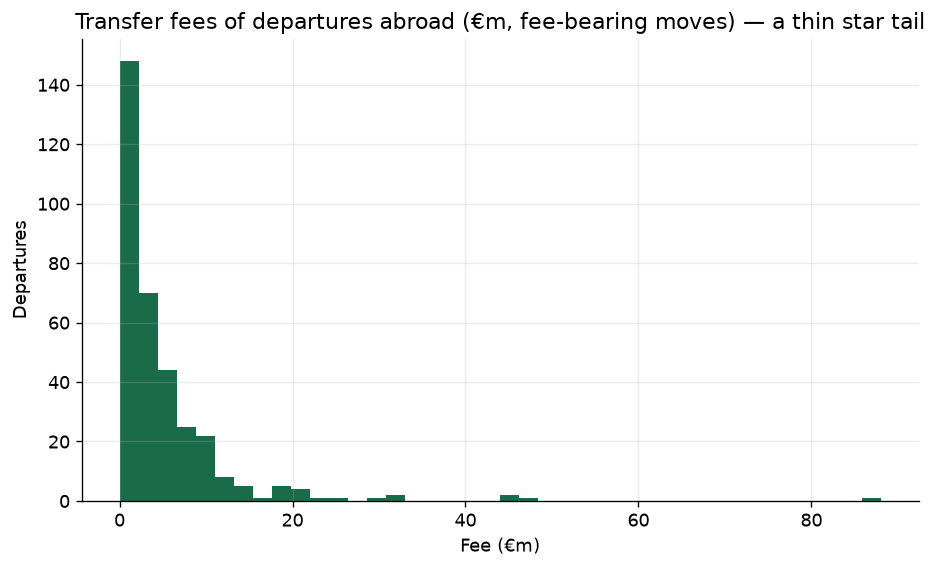
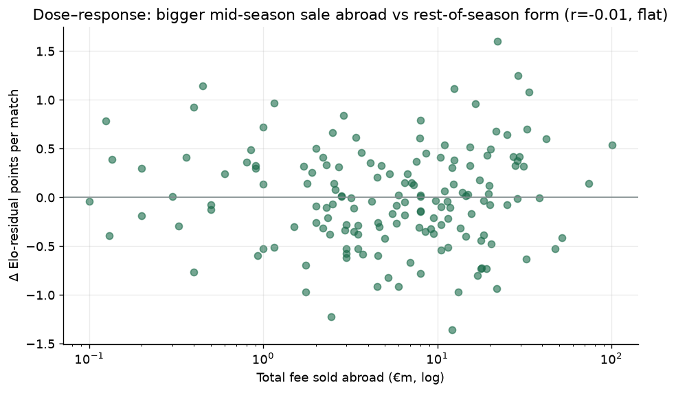
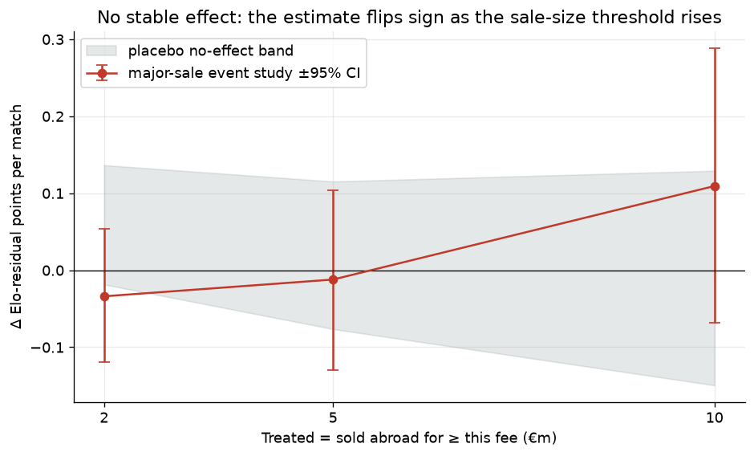

# Chapter C — The Mid-Season Exodus: Does Losing a Star Mid-Campaign Cost You?

In the middle of the 2013 Brasileirão season, Santos sold the 21-year-old Neymar
to Barcelona for €88 million. Brazil's league was barely at its halfway point;
Spain's was about to start. It is the most famous example of a structural quirk
that repeats every single year: Brazil's Série A runs on the calendar year
(April–December), while Europe's summer transfer window opens in July and closes
in early September — squarely in the *middle* of the Brazilian season. So every
July and August, Brazilian clubs ship their best players to Europe with half a
league campaign still to play, and then have to keep playing it.

The list of players who left mid-campaign is a who's-who of the modern game:
Neymar, Vinicius Júnior (Flamengo → Real Madrid, €45m), Rodrygo (Santos → Real
Madrid, €45m), Endrick (Palmeiras → Real Madrid, €47.5m), Oscar (Internacional →
Chelsea, €32m), Arthur (Grêmio → Barcelona, €31m). This chapter asks the obvious
question and tries to answer it honestly: **does the club left behind suffer a
measurable dip in form over the rest of the season?**

The intuition says yes, obviously. The data — measured carefully, against a
no-effect baseline, with the actual stars in the sample — says: **no, not
detectably.** And that turns out to be the more interesting answer.

## The data: scraping the full picture

An earlier version of this analysis used an open Transfermarkt data dump and
found only ~64 mid-season departures across twelve seasons — suspiciously few. The
dump, it turned out, is biased toward a recent player universe and silently
undercounts history: it was missing most of the stars above. So this version goes
to the source. Match results and pre-match [causal Elo](chapter-a-home-advantage.md) come from the
project's clean Brasileirão history (2003–2024); the **departures** come from
scraping Transfermarkt's per-club-season transfer pages directly — rate-limited,
cached to disk, and filtered to the **summer window** (which lands mid-Brazilian
season), so no exact transfer date is even needed: the window *is* the treatment.

That yields **3,330 summer departures** across the 240 Série A club-seasons of
2012–2024 — fifty times what the dump saw — of which **1,227 are moves abroad**.
The genuine star sales are the thin tail of that distribution; the bulk are loans
and free transfers of squad players to smaller clubs.





Two limitations shape what follows, stated plainly:

- **Transfer fees are the size signal, and they're partial.** Fees are recorded
  for **45%** of the moves abroad (median €0.65m, up to Neymar's €88m); the rest
  are loans or undisclosed. A player leaving on **loan** — even a significant one,
  like a loan-with-obligation to a European club — carries no fee, so it counts as
  a departure but contributes zero to the "how big was the sale" dose.
- **Scraping is fragile and against Transfermarkt's terms.** It works, cached, at
  a polite crawl rate, but a portfolio piece should say plainly that this source
  is less robust and less clean than an official feed would be.

Portugal is the most common first stop — Estoril and Portimonense are the two
single most frequent destinations, the classic stepping-stone route — though the
next-busiest are Italy's Udinese and Ukraine's Shakhtar Donetsk, both well-known
importers of Brazilian talent, before Benfica, Nacional and Porto.

## Why "did they sell?" is the wrong question

Here is the fact that reshapes the whole analysis: **234 of the 240 club-seasons
(98%) had at least one player leave for a foreign club that summer.** Selling
someone abroad mid-season isn't an event that separates clubs — it's what every
club does, every year. So the natural design of the earlier version — compare
clubs that sold against clubs that didn't — is *degenerate here*: there is
essentially no "didn't" group.

The signal, if there is one, cannot be *whether* a club sold. It has to be *how
much* it sold. So the analysis pivots to two size-based tests, each measured the
same honest way — the change in a club's **Elo-residual points** (actual minus
what its pre-match rating expects, so the differing second-half schedule is netted
out) from before the window to after it.

## Test 1 — the dose–response

If losing talent mid-season hurts, then losing *more* talent should hurt *more*.
Plot every club-season's rest-of-season form change against the total fee it
banked selling players abroad that summer, and the slope should run downhill.



It doesn't. The relationship is **flat**: the correlation between the (log) fee
sold abroad and the rest-of-season change in Elo-residual points is **−0.01**,
across all 240 club-seasons — indistinguishable from no relationship at all. Clubs
that sold €50m of talent mid-season did not, on average, fall away any more than
clubs that sold €2m.

## Test 2 — the major-sale event study, and why the threshold matters

Maybe the effect only bites for *genuinely* big sales — a real starter or star,
not squad filler. So define "treated" as a club-season that sold a player abroad
for at least some fee threshold, compare its before/after form change to the
non-selling clubs', and — crucially — check it against a **placebo no-effect
floor** (assign fake sales to the control clubs and re-run, the same discipline as
Chapters A and B). The trouble is choosing the threshold, so we don't choose one —
we sweep it, and report what happens.



| Treated = sold abroad for ≥ | Treated / Control | Effect (Δresid/match) | 95% CI | Clears floor? | DiD |
|---|---|---|---|---|---|
| €2m | 127 / 113 | **−0.034** | [−0.12, +0.05] | marginally | −0.13 |
| €5m | 81 / 159 | **−0.012** | [−0.13, +0.10] | no | +0.00 |
| €10m | 40 / 200 | **+0.109** | [−0.07, +0.29] | no | +0.19 |

The estimate is **not stable**. At a €2m threshold it is mildly negative and just
grazes the edge of the placebo floor — but its own confidence interval spans zero,
and it does not survive to €5m. At a €10m threshold it actually turns *positive*:
the clubs selling their biggest stars abroad (Santos, Flamengo, Palmeiras,
Grêmio) tend to be the strongest clubs, who keep winning — and if anything post
slightly *better* residuals afterward, not worse. No specification clears its
placebo floor convincingly, and the difference-in-differences (matched on
pre-window Elo) tells the same story, swinging from −0.13 to +0.19 across the
same thresholds. Reporting the lone marginal €2m result as "the answer" would be
exactly the cherry-picking this project forbids; the honest reading of a sign that
flips with the threshold is **no stable effect**.

## The verdict

The honest verdict is **(c): no detectable effect** — and, unlike the sparse-data
version, this one is *well-powered and hard to dismiss*. We now have the actual
stars in the sample (Neymar, Vinicius, Rodrygo, Endrick, Oscar, Arthur), 234
treated club-seasons instead of a few dozen, and every reasonable specification —
a flat dose–response and a threshold sweep whose sign flips — points the same way:
losing even a genuine star mid-campaign does not produce a measurable
rest-of-season dip for the Brazilian club left behind.

Why might that be true? The clubs that sell the biggest players are the biggest
clubs, with the deepest squads and the most cash to reinvest immediately; a
Neymar or a Vinicius is sold *because* he is exceptional, but the team around him
was already strong and stays in the league. Half a season is long enough for that
depth, and for the ordinary noise of football, to swamp one player's July exit.
The vivid story — sell your star mid-season and your campaign collapses — is one
of those things that feels obviously true and simply isn't, once you put the real
stars in the data and hold them against a no-effect baseline. It joins Chapter A's
"the quirks don't beat Elo" and Chapter B's "the entropy metric lies" as a finding
whose value is in refusing to overclaim.

## Limitations

- **Fees are a partial, imperfect dose.** Only 45% of moves abroad carry a fee, so
  the dose is measured on the disclosed subset; loans (even significant ones) enter
  as zero-fee departures. A better size signal — say each player's share of the
  club's minutes in the prior half-season — isn't available historically in this
  source, so a small effect concentrated in truly irreplaceable players cannot be
  fully ruled out.
- **The source is a scrape.** Transfermarkt's club pages are unofficial and
  scraped against their terms; the pipeline caches and crawls politely, but this is
  less robust and less clean than a licensed feed, and the HTML can change.
- **Selection on unobservables remains.** The biggest sellers are the strongest
  clubs; the DiD matches on pre-window Elo and the placebo floor bounds the noise,
  but a club selling under financial distress carries problems Elo cannot see.
- **Departures are gross, not net of arrivals.** Clubs that sell a star often buy a
  replacement in the same window; not modelling incoming signings biases the
  estimate *toward zero*, so a real effect would be understated, not inflated.
- **Half-season windows are noisy.** The outcome is a club's form over ~15–20
  remaining matches; that is a short, noisy stretch, which is part of why even a
  real effect of a plausible size would be hard to detect here.

## Reproduce

Departures are scraped from Transfermarkt's per-club-season transfer pages on
first run and cached under `data/raw/tm/` (gitignored); match results and Elo come
from `data/processed/matches.parquet` (Chapter A's pipeline). All logic lives in
`brasileirao.transfers` (the scraper + fee/destination parsing) and
`brasileirao.exodus` (Elo-expected par points, the window split, and the
estimators); the notebooks hold only narrative and figures.

```powershell
# 1. Environment (Python 3.13) and tests
.venv\Scripts\python -m pip install -e ".[dev]"
.venv\Scripts\python -m pytest -q

# 2. Scrape/assemble departures, then run the dose-response + threshold sweep
#    (first run crawls ~240 pages at a polite rate; re-runs read the cache)
.venv\Scripts\python -m jupyter nbconvert --to notebook --execute --inplace notebooks/06_transfer_data.ipynb --ExecutePreprocessor.timeout=1800
.venv\Scripts\python -m jupyter nbconvert --to notebook --execute --inplace notebooks/07_exodus_event_study.ipynb --ExecutePreprocessor.timeout=900
```

Notebook 06 builds the departures table and the transfer-landscape figures;
Notebook 07 runs the dose–response and the threshold sweep, renders the figures
above, and prints the verdict. Each headline number here is printed by one of the
two notebooks.
